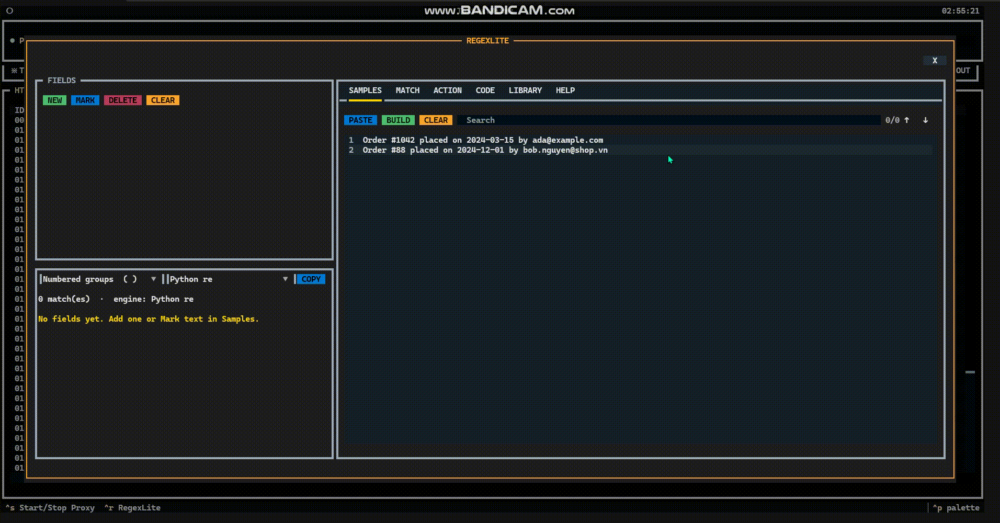
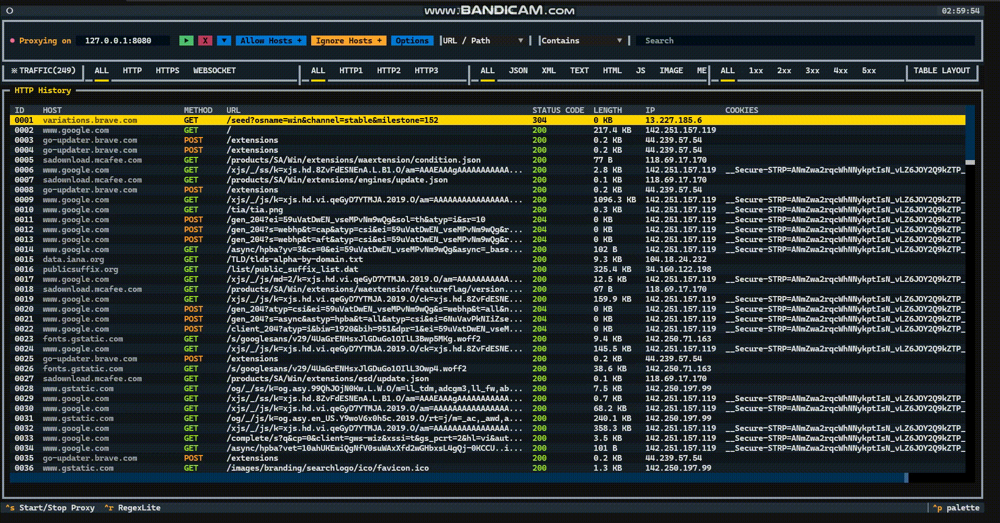

# Textual-Mitms

**Textual-Mitms is a terminal-based MITM proxy tool built on Textual and mitmproxy.**
It allows you to capture, view, and filter HTTP/HTTPS, WebSocket, and TCP packets directly within a TUI—offering a compact, fast, and simple experience without the need to open a web browser.


## Features
- Live HTTP(S) history
- Capture HTTP/2, HTTP/3, and WebSocket packets
- Search 13 field, 10 mode
- Allow / Ignore hosts
- Filter AND — protocol (HTTP/HTTPS/WEBSOCKET), HTTP1/2/3, MIME, 1xx–5xx.
- Copy / Save — body, headers JSON, cURL, URL,..
- The RegexLite tool makes creating regular expressions simple and efficient.
- The Curlconverter tool helps convert cURL commands into various programming languages.
## Installing

#### The package can be installed with `pip` or related tools, for example:

```sh
pip install textual-mitms==0.2.1
```

#### Run CLI
```sh
textual-mitms --help
```
#### Install CA certificate (Run as administrator)
```sh
textual-mitms cert generate
```
```sh
textual-mitms cert status
```
```sh
textual-mitms cert install
```
#### Now you can run textual-mitms via the command line:

```sh
textual-mitms
```
#### Uninstall CA certificate (Run as administrator)
```sh
textual-mitms cert uninstall
```

## Using basic RegexLite


## Using basic Curlconverter


## Dependent
- [mitmproxy](https://docs.mitmproxy.org/) — An interactive TLS-capable intercepting HTTP proxy for penetration testers and software developers.
- [Textual](https://textual.textualize.io/) — The lean application framework for Python. Build sophisticated user interfaces with a simple Python API. Run your apps in the terminal and a web browser.
